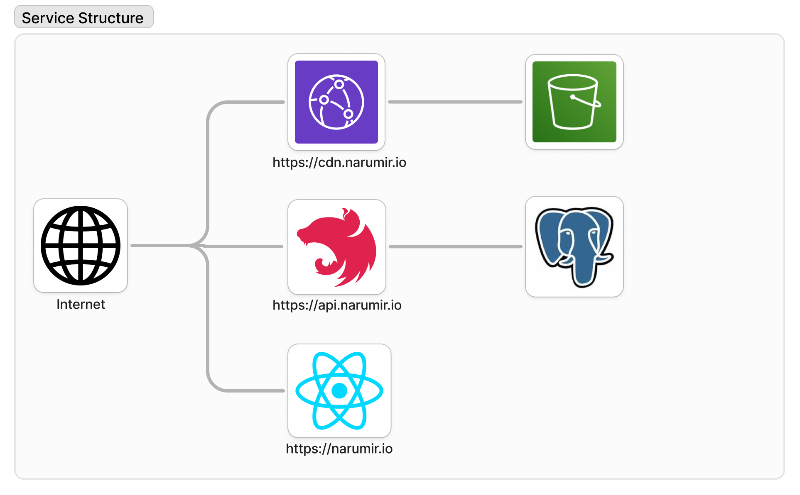
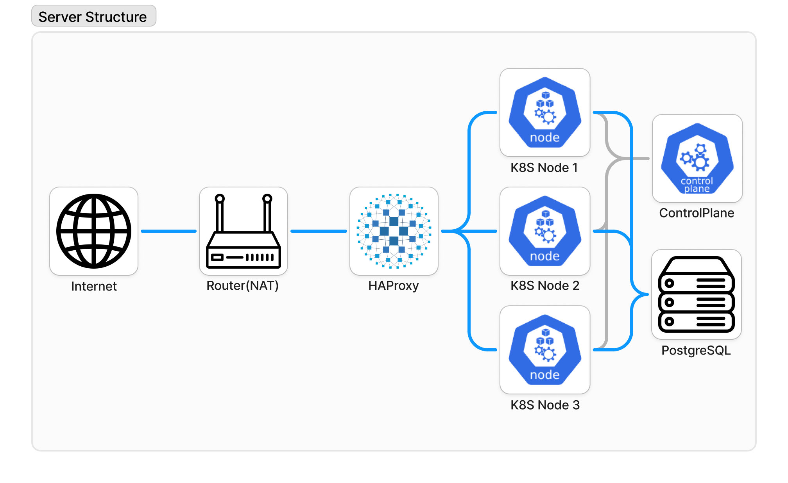

# 개요
blog 프로젝트에서 사용하는 K8S iac 프로젝트 입니다.

## 앱 레포지토리
* [blog-web](https://github.com/narumir/blog-web) (SSR 적용된 웹 프론트엔드)
* [blog-api](https://github.com/narumir/blog-api) (API 서버)

## 서비스 구조

## 설치된 도구 목록
* [ingress-nginx](https://kubernetes.github.io/ingress-nginx/)
* [cert-manager](https://cert-manager.io/)
* [grafana](https://grafana.com/) (link: [grafana.narumir.io](https://grafana.narumir.io))
* [prometheus](https://prometheus.io/)
* [argocd](https://argoproj.github.io/cd/) (link: [argocd.narumir.io](https://argocd.narumir.io))

## 서버 구조

### IP 주소

name              | ip address     | description
------------------|----------------|----------------------
Router            | 192.168.50.1   | NAT Router
HAProy            | 192.168.50.102 | external loadbalancer
K8S Control Plane | 192.168.50.120 | control plance
K8S Node 1        | 192.168.50.121 | node 1
K8S Node 2        | 192.168.50.122 | node 2
K8S Node 3        | 192.168.50.123 | node 3
PostgreSQL        | 192.168.50.104 | Database

### 서버 성능
name              | CPU    | Momory | Disk  | NIC
------------------|--------|--------|-------|------------------------------------
Router            | N/A    | N/A    | N/A   | 500mbps(external) / 1Gbps(internal)
HAProy            | 2vCPUs | 2Gi    | 16Gi  | 10Gbps
K8S Control Plane | 4vCPUs | 4Gi    | 32Gi  | 10Gbps
K8S Node 1        | 4vCPUs | 8Gi    | 32Gi  | 10Gbps
K8S Node 2        | 4vCPUs | 8Gi    | 32Gi  | 10Gbps
K8S Node 3        | 4vCPUs | 8Gi    | 32Gi  | 10Gbps
PostgreSQL        | 2vCPUs | 4Gi    | 128Gi | 10Gbps
